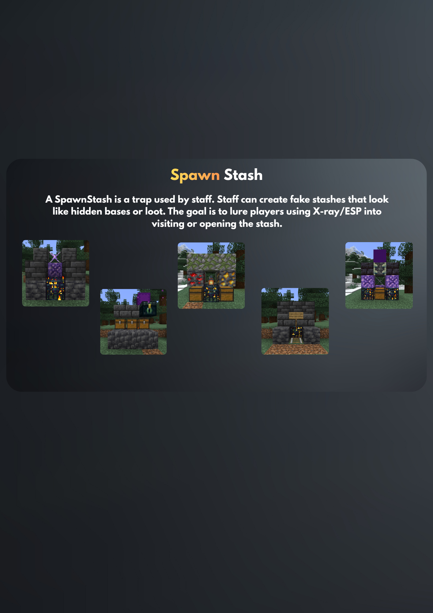

<p align="center">
  
</p>

<h1 align="center">UltimateDonutSmp (FREE)</h1>

<p align="center">
  Free Paper, Spigot, and Folia plugin for DonutSMP-style Minecraft servers.
  Economy, PvP, marketplace, staff tools, menus, and network utilities in one production-focused plugin.
</p>

<p align="center">
  
  
  
  
</p>

## Overview

UltimateDonutSmp is a complete Paper Minecraft server plugin built for DonutSMP-style survival networks. It combines player economy, teams, homes, warps, random teleport, shop, sell, worth, crates, shards, PvP systems, staff utilities, network communication, and GUI-driven workflows into one plugin.

The goal is to reduce the number of separate plugins required for a modern SMP server while keeping configuration, player data, permissions, placeholders, and staff operations consistent across the entire server experience.

## Highlights

| Area | Included systems |
| --- | --- |
| Platforms | Separate Paper/Spigot and Folia builds with compatibility checks against the latest published APIs |
| Economy | Money, shards, player payments, Vault provider, shop, sell workflows, worth browser, and sell history |
| Marketplaces | Auction House, Orders board, Billford rotating trades, category filters, claims, delivery, and search |
| Player systems | Teams, friends/follows, homes, warps, private messages, ignore lists, profiles, settings, and custom Ender Chests |
| Progression | Stats, playtime, leaderboards, scoreboards, tablists, bounties, and PlaceholderAPI expansions |
| Teleportation | Spawn, AFK areas, TPA, RTP, portals, cuboid triggers, teleport areas, and safe-location checks |
| PvP | Duels, private invites, map queues, FFA instances, arena rollback, fast crystals, and combat handling |
| Custom content | Crates, virtual keys, Donut-style spawners, amethyst tools, enchantment GUI, filters, and configurable menus |
| Staff and moderation | Staff mode, freeze, vanish, hide/disguise, invsee, ecsee, punishments, alts, reports, helpop, and anvil moderation |
| Detection tools | Spawn-stash bait, fake-player bait, spawner anti-ESP, alerts, bypass permissions, and crash protection |
| Network | Redis staff chat and alerts, server-status menus, maintenance routing, Discord webhooks, and Lunar/Apollo support |
| Operations | Automatic configuration sync and backups, feature toggles, setup tools, optimization controls, stats wipe, and guarded server wipe |
| Localization | English, Spanish, Indonesian, Portuguese, German, French, Russian, and Simplified Chinese language packs |

## Screenshots

<p align="center">
  
  
  
  
  
  
  
  
  
  
  
  
  
  
  
  
  
  
  
  
  
  
  
  
</p>


## Requirements

| Requirement | Notes |
| --- | --- |
| Plugin version | `1.3` |
| Java | Bytecode targets Java 21. Use the Java version required by the selected Minecraft server; Minecraft 26.1+ requires Java 25. |
| Paper / Spigot | Minecraft `1.21.10` through `26.2` |
| Folia | Minecraft `1.21.11` through `26.1.2` |
| Hard dependencies | None |
| Default storage | SQLite, bundled through the shaded JDBC driver |
| Alternative storage | MySQL or MongoDB |
| Optional network layer | Redis for cross-server staff chat, alerts, maintenance, reports, helpop, and server status |
| Build environment | Windows PowerShell, Maven available as `mvn`, internet access, and a JDK compatible with the target server API |

Optional integrations:

- PlaceholderAPI
- LuckPerms
- Vault
- ProtocolLib
- Apollo
- NickPlus
- SkinsRestorer
- Multiverse-Core
- floodgate

The plugin starts without these soft dependencies. Their related placeholder, permission, economy, packet, skin, world, Bedrock, and client integrations activate only when the corresponding plugin is installed.

## Building

Use the platform-specific build scripts from the project root:

```bat
build-paper&spigot.bat
build-folia.bat
```

Each script first compiles the selected source set against the latest API published by the official server project, then packages the distributable jar against the oldest supported API. This catches forward API breakage without linking the release artifact to newer-only methods.

Generated artifacts are copied to `dist/`, and their names include the supported range:

- `UltimateDonutSmp-1.3.3-paper-spigot-1.21.10-26.2.jar`
- `UltimateDonutSmp-1.3.3-folia-1.21.11-26.1.2.jar`

To run endpoint startup checks against official Paper and Folia server jars:

```powershell
.\scripts\smoke-server-matrix.ps1
```

## Installation

1. Stop the Minecraft server.
2. Place the plugin jar into the server `plugins/` directory.
3. Start the server once so the default configuration files are generated.
4. Configure storage in `database.yml`.
5. Review the core gameplay files such as `config.yml`, `menus.yml`, `shop.yml`, `worth.yml`, `rtp.yml`, and `messages.yml`.
6. Restart the server after first setup.

For production networks, MySQL plus Redis is recommended. For a single-server setup, SQLite is usually enough.

> [!WARNING]
> Do not share private customer files, database credentials, Discord tokens, Redis passwords, or other sensitive server data.

## Configuration

| File | Purpose |
| --- | --- |
| `config.yml` | Language selection, feature toggles, locations, portals, chat, AFK, cuboid binds, combat, crystals, shards, tablist, optimization, and general gameplay |
| `messages.yml` | Legacy command, gameplay, moderation, economy, teleport, and system messages |
| `death-messages.yml` | Death-message rules and message templates |
| `menus.yml` | Shared GUI layouts for teams, homes, profiles, settings, leaderboards, shops, staff tools, rules, servers, and other menus |
| `scoreboard.yml` | Scoreboard title, lines, refresh behavior, and display rules |
| `shop.yml` | Money and shard shop categories, items, prices, permissions, currencies, and command rewards |
| `sounds.yml` | Sound effects for menus, commands, teleportation, shops, shards, boosters, and custom systems |
| `billford.yml` | Billford rotation, access permission, countdowns, announcements, trades, GUI, and feedback |
| `rtp.yml` | Random teleport worlds, radius, cooldowns, safety checks, denied worlds, messages, and GUI |
| `worth.yml` | Sell values, worth display, container handling, browser categories, and blocked items |
| `amethyst-tools.yml` | Amethyst tool types, durations, permissions, effects, items, actions, and messages |
| `ender-chest.yml` | Custom Ender Chest size, behavior, ecsee access, layout, and messages |
| `invsee.yml` | Inventory inspection behavior, layout, permissions, and messages |
| `freeze.yml` | Freeze behavior, permissions, alerts, inventory handling, and messages |
| `auction-house.yml` | Listing limits, pricing, claims, restrictions, sorting, categories, and Auction House GUI |
| `orders.yml` | Order limits, pricing, delivery, matching, filters, sorting, Bedrock input, network behavior, and GUI |
| `enchantments.yml` | Enchantment GUI and item-specific enchantment options |
| `filter.yml` | Item category filters used by marketplace and inventory workflows |
| `duels.yml` | Duel maps, world borders, queues, countdowns, cross-server options, arena settings, rules, and GUI |
| `ffa.yml` | FFA queue, arena rules, rollback, player-state handling, and arena definitions |
| `crates.yml` | Crate definitions, keys, rewards, animations, holograms, particles, and settings |
| `spawners.yml` | Donut-style spawner types, drops, storage, anti-ESP, visibility, and GUI |
| `spawn-stash.yml` | Temporary bait-stash types, detection rules, alerts, cleanup, and messages |
| `network.yml` | Redis network identity, staff chat, reports, helpop, server status, and maintenance routing |
| `staff-mode.yml` | Staff-mode permissions, hotbar items, vanish, better view, staff list, fake players, and menus |
| `hide.yml` | Identity scrambling, aliases, disguises, skins, cooldowns, bypass rules, GUI, and messages |
| `database.yml` | SQLite, MySQL, MongoDB, and Redis connection settings |
| `server-wipe.yml` | Guarded wipe targets, protected worlds, confirmation token lifetime, backups, and messages |
| `discord.yml` | Discord webhook endpoints and event-specific webhook controls |
| `anvil-moderation.yml` | Banned anvil words, punishments, and per-player moderation data |

Language files are stored under `languages/`:

- `en_US.yml`
- `es_ES.yml`
- `id_ID.yml`
- `pt_BR.yml`
- `de_DE.yml`
- `fr_FR.yml`
- `ru_RU.yml`
- `zh_CN.yml`

On startup and reload, missing bundled configuration paths are merged into existing files. Existing files are backed up under `config-backups/` before an automatic update. Live crate definitions, duel/FFA arenas, and deployment-specific network server entries are treated as user-managed data and are not restored after removal.

## Commands

Commands can be disabled through their related feature toggle. Arguments in `<angle brackets>` are required; arguments in `[square brackets]` are optional.

| Command | Aliases | Usage |
| --- | --- | --- |
| `/addmoney` | - | `/addmoney <player> <amount>` |
| `/addshards` | - | `/addshards <player> <amount>` |
| `/afk` | - | `/afk` |
| `/alts` | - | `/alts <player>` |
| `/amethysttool` | - | `/amethysttool give <player> <type> [duration]` or `/amethysttool reload` |
| `/amod` | - | `/amod <add\|reload>` |
| `/arena` | `/duelarena` | `/arena <create\|delete\|setpos1\|setpos2\|setreturn\|setdisplay\|enable\|disable\|queue\|list\|reload>` |
| `/auctionhouse` | `/ah` | `/auctionhouse [sell\|my\|claims\|cancel\|limit\|fastbuy\|fastsell\|reload]` |
| `/balance` | `/bal`, `/money` | `/balance [player]` |
| `/ban` | - | `/ban <player> [reason]` |
| `/billford` | - | `/billford` |
| `/blacklist` | - | `/blacklist <player> [reason]` |
| `/bounty` | - | `/bounty <add\|set\|info\|list> [player] [amount]` |
| `/chat` | - | `/chat <help\|mute\|unmute\|delay\|clear>` |
| `/clearlag` | - | `/clearlag` |
| `/crate` | - | `/crate <create\|delete\|type\|open\|keys\|reload\|key\|take\|set\|keyall\|add\|edit\|remove\|bind\|unbind\|info>` |
| `/crates` | - | `/crates` |
| `/create` | - | `/create <invite\|friends> <player> [map]` |
| `/cuboid` | - | `/cuboid <wand\|create\|delete\|list\|bind <cuboid> <spawn\|shard\|rtp-zone> <true\|false>\|reload>` |
| `/delhome` | - | `/delhome <name>` |
| `/delwarp` | - | `/delwarp <name>` |
| `/discord` | - | `/discord` |
| `/disguise` | - | `/disguise [player-name\|url]` or `/disguise <alias> <player-name\|url>` |
| `/draw` | - | `/draw` |
| `/duel` | - | `/duel [player\|accept\|deny\|claims\|reload]` |
| `/ecsee` | - | `/ecsee <player>` |
| `/enderchest` | `/ec` | `/enderchest [reload]` |
| `/fakeplayer` | `/fplayer` | `/fakeplayer` |
| `/feed` | - | `/feed [player]` |
| `/ffa` | - | `/ffa [join\|reload\|arena ...]` |
| `/ffaarena` | - | `/ffaarena <create\|delete\|setpos\|setdisplay\|settings\|enable\|disable\|list\|reload>` |
| `/ffastats` | - | `/ffastats [player]` |
| `/findplayer` | `/fp` | `/findplayer <player>` |
| `/fly` | - | `/fly [player]` |
| `/freeze` | - | `/freeze <player>` or `/freeze reload` |
| `/friends` | `/friend` | `/friends [list\|follow\|remove\|search\|following\|followers\|friends]` |
| `/gamemode` | `/gm`, `/gmc`, `/gms`, `/gma`, `/gmsp` | `/gamemode <mode> [player]` |
| `/god` | `/godmode` | `/god [player]` |
| `/heal` | - | `/heal [player]` |
| `/help` | - | `/help` |
| `/helpop` | - | `/helpop <message>` |
| `/hide` | - | `/hide [status\|scramble\|remove\|check <player>\|list]` |
| `/home` | - | `/home [name]` |
| `/homes` | - | `/homes` |
| `/ignore` | - | `/ignore <player\|list>` |
| `/invsee` | `/inventorysee` | `/invsee <player>` or `/invsee reload` |
| `/keys` | - | `/keys` |
| `/kick` | - | `/kick <player> [reason]` |
| `/kill` | `/suicide` | `/kill` |
| `/leaderboard` | `/lb`, `/top`, `/leaderboards`, `/baltop` | `/leaderboard [type]` |
| `/leave` | - | `/leave` |
| `/maintenance` | - | `/maintenance <on\|off\|status\|setlobby [server]>` |
| `/msg` | `/message`, `/tell`, `/whisper`, `/w` | `/msg <player> <message>` |
| `/mute` | - | `/mute <player> [reason]` |
| `/nightvision` | `/nv` | `/nightvision` |
| `/orders` | `/order` | `/orders [my\|collect\|reload\|search query]` |
| `/pay` | - | `/pay <player> <amount>` |
| `/phantom` | - | `/phantom` |
| `/ping` | - | `/ping [player]` |
| `/playtime` | `/pt` | `/playtime [player]` |
| `/pm` | `/togglepm`, `/privatemessages` | `/pm` |
| `/portalmanager` | - | `/portalmanager <list\|info\|create\|delete\|setcuboid\|setdestination\|setdisplay\|toggle\|setpriority\|sethologramhere>` |
| `/profileviewer` | `/pv` | `/profileviewer <player>` |
| `/punishments` | `/phistory` | `/punishments <player>` |
| `/queue` | - | `/queue [join\|leave] [map]` |
| `/randomteleport` | `/randomtp` | `/randomteleport` |
| `/removemoney` | - | `/removemoney <player> <amount>` |
| `/removeshards` | - | `/removeshards <player> <amount>` |
| `/rename` | - | `/rename <name...\|reset>` |
| `/renamehome` | - | `/renamehome <old> <new>` |
| `/reply` | `/r` | `/reply <message>` |
| `/report` | - | `/report <player> <reason>` |
| `/rtp` | - | `/rtp [world]` |
| `/rules` | - | `/rules` |
| `/safety` | - | `/safety [reload\|add [player]]` |
| `/sell` | - | `/sell` |
| `/sellall` | - | `/sellall` |
| `/sellhand` | - | `/sellhand [amount]` |
| `/sellhistory` | - | `/sellhistory` |
| `/servers` | - | `/servers` |
| `/serverwipe` | - | `/serverwipe <preview\|prepare\|confirm\|cancel\|status>` |
| `/sethome` | - | `/sethome [name]` |
| `/setmoney` | - | `/setmoney <player> <amount>` |
| `/setshards` | - | `/setshards <player> <amount>` |
| `/settings` | - | `/settings` |
| `/setwarp` | - | `/setwarp <name>` |
| `/shardpay` | - | `/shardpay <player> <amount>` |
| `/shards` | - | `/shards [player]` or `/shards everywhere <status\|debug> [player]` |
| `/shardshop` | - | `/shardshop` |
| `/shop` | - | `/shop [reload]` |
| `/social` | `/media` | `/social` |
| `/spawn` | - | `/spawn` |
| `/spawner` | `/spawners` | `/spawner [give\|info\|panel\|reload\|remove]` |
| `/spawnstash` | `/stash` | `/spawnstash [type\|spawn\|list\|remove\|reload]` |
| `/staffchat` | `/sc` | `/staffchat <message>` |
| `/stafflist` | - | `/stafflist` |
| `/staffmode` | `/staff` | `/staffmode [player\|reload]` |
| `/stats` | - | `/stats [player]` |
| `/store` | - | `/store` |
| `/team` | - | `/team <create\|disband\|invite\|kick\|join\|leave\|home\|sethome\|delhome\|chat\|info\|pvp>` |
| `/teleport` | `/tp`, `/tphere`, `/tpall` | `/teleport <player\|here <player>\|all\|top\|x y z [world]>` |
| `/tempban` | - | `/tempban <player> <time> [reason]` |
| `/tempmute` | - | `/tempmute <player> <time> [reason]` |
| `/tpa` | - | `/tpa <player>` |
| `/tpacancel` | - | `/tpacancel` |
| `/tpaccept` | - | `/tpaccept [player]` |
| `/tpadeny` | - | `/tpadeny [player]` |
| `/tpahere` | - | `/tpahere <player>` |
| `/tpahereauto` | - | `/tpahereauto` |
| `/tpauto` | - | `/tpauto` |
| `/twitter` | - | `/twitter` |
| `/ultimatedonutsmp` | `/uds`, `/udsmp` | `/ultimatedonutsmp <reload\|statswipe\|optimize\|setup\|features\|maintenance>` |
| `/unban` | `/pardon` | `/unban <player> [reason]` |
| `/unblacklist` | - | `/unblacklist <player> [reason]` |
| `/unignore` | - | `/unignore <player>` |
| `/unmute` | - | `/unmute <player> [reason]` |
| `/vanish` | - | `/vanish` |
| `/warn` | - | `/warn <player> [reason]` |
| `/warp` | - | `/warp [name]` |
| `/warpmanager` | - | `/warpmanager <create\|delete\|list> [name]` |
| `/worth` | `/prices` | `/worth [hand\|reload]` |

Temporary punishment durations accept combined values such as `30s`, `15m`, `2h`, `5d`, or `5d 15m 30s`.

## Permissions

`true` means the permission is granted by default, `op` means it defaults to server operators, and `false` means it must be granted explicitly. `ultimatedonutsmp.admin` is the main admin parent node, while several configurable or specialized nodes remain separate.

| Permission | Default | Permission | Default |
| --- | --- | --- | --- |
| `anvilmod.admin` | `op` | `ultimatedonutsmp.hide.disguise` | `op` |
| `donutauction.buy` | `false` | `ultimatedonutsmp.hide.scramble` | `op` |
| `donutauction.cancel` | `false` | `ultimatedonutsmp.ignore` | `true` |
| `donutauction.claims` | `false` | `ultimatedonutsmp.ignore.bypass` | `op` |
| `donutauction.fastbuy` | `false` | `ultimatedonutsmp.message` | `true` |
| `donutauction.fastsell` | `false` | `ultimatedonutsmp.message.bypass-disabled` | `op` |
| `donutauction.limit` | `false` | `ultimatedonutsmp.message.toggle` | `true` |
| `donutauction.my` | `false` | `ultimatedonutsmp.report` | `true` |
| `donutauction.sell` | `false` | `ultimatedonutsmp.servers` | `false` |
| `donutauction.use` | `false` | `ultimatedonutsmp.shards.everywhere` | `false` |
| `safety.add` | `op` | `ultimatedonutsmp.shardshop` | `true` |
| `safety.reload` | `op` | `ultimatedonutsmp.staff.alerts.bypass-cooldown` | `op` |
| `safety.use` | `true` | `ultimatedonutsmp.staff.alerts.receive` | `op` |
| `ultimatedonutsmp.admin` | `op` | `ultimatedonutsmp.staff.alts` | `op` |
| `ultimatedonutsmp.admin.addmoney` | `op` | `ultimatedonutsmp.staff.chat.bypass.delay` | `op` |
| `ultimatedonutsmp.admin.amethysttool` | `op` | `ultimatedonutsmp.staff.chat.bypass.filter` | `op` |
| `ultimatedonutsmp.admin.auctionhouse` | `op` | `ultimatedonutsmp.staff.chat.bypass.mute` | `op` |
| `ultimatedonutsmp.admin.clearlag` | `op` | `ultimatedonutsmp.staff.chat.clear` | `op` |
| `ultimatedonutsmp.admin.crate` | `op` | `ultimatedonutsmp.staff.chat.delay` | `op` |
| `ultimatedonutsmp.admin.crate.keyall` | `op` | `ultimatedonutsmp.staff.chat.mute` | `op` |
| `ultimatedonutsmp.admin.crate.reload` | `op` | `ultimatedonutsmp.staff.chat.unmute` | `op` |
| `ultimatedonutsmp.admin.cuboid` | `op` | `ultimatedonutsmp.staff.chat.use` | `op` |
| `ultimatedonutsmp.admin.delwarp` | `op` | `ultimatedonutsmp.staff.fakeplayer` | `op` |
| `ultimatedonutsmp.admin.duels` | `op` | `ultimatedonutsmp.staff.fakeplayer.alert` | `op` |
| `ultimatedonutsmp.admin.ecsee` | `op` | `ultimatedonutsmp.staff.fakeplayer.bypass` | `op` |
| `ultimatedonutsmp.admin.enderchest` | `op` | `ultimatedonutsmp.staff.feed` | `op` |
| `ultimatedonutsmp.admin.ffa` | `op` | `ultimatedonutsmp.staff.fly` | `op` |
| `ultimatedonutsmp.admin.freeze` | `op` | `ultimatedonutsmp.staff.freeze` | `op` |
| `ultimatedonutsmp.admin.invsee` | `op` | `ultimatedonutsmp.staff.freeze.alert` | `op` |
| `ultimatedonutsmp.admin.optimize` | `op` | `ultimatedonutsmp.staff.freeze.exempt` | `op` |
| `ultimatedonutsmp.admin.orders` | `op` | `ultimatedonutsmp.staff.gamemode` | `op` |
| `ultimatedonutsmp.admin.portalmanager` | `op` | `ultimatedonutsmp.staff.gamemode.others` | `op` |
| `ultimatedonutsmp.admin.reload` | `op` | `ultimatedonutsmp.staff.god` | `op` |
| `ultimatedonutsmp.admin.removemoney` | `op` | `ultimatedonutsmp.staff.heal` | `op` |
| `ultimatedonutsmp.admin.serverwipe` | `op` | `ultimatedonutsmp.staff.helpop.receive` | `op` |
| `ultimatedonutsmp.admin.setmoney` | `op` | `ultimatedonutsmp.staff.invsee` | `op` |
| `ultimatedonutsmp.admin.setwarp` | `op` | `ultimatedonutsmp.staff.invsee.modify` | `op` |
| `ultimatedonutsmp.admin.shards` | `op` | `ultimatedonutsmp.staff.mode` | `op` |
| `ultimatedonutsmp.admin.shop` | `op` | `ultimatedonutsmp.staff.mode.betterview` | `op` |
| `ultimatedonutsmp.admin.spawner` | `op` | `ultimatedonutsmp.staff.mode.others` | `op` |
| `ultimatedonutsmp.admin.spawner.seeall` | `op` | `ultimatedonutsmp.staff.mode.randomtp` | `op` |
| `ultimatedonutsmp.admin.spawnstash` | `op` | `ultimatedonutsmp.staff.mode.seevanished` | `op` |
| `ultimatedonutsmp.admin.staffmode` | `op` | `ultimatedonutsmp.staff.mode.stafflist` | `op` |
| `ultimatedonutsmp.admin.statswipe` | `op` | `ultimatedonutsmp.staff.mode.vanish` | `op` |
| `ultimatedonutsmp.admin.warpmanager` | `op` | `ultimatedonutsmp.staff.profileviewer` | `op` |
| `ultimatedonutsmp.admin.worth` | `op` | `ultimatedonutsmp.staff.punishments.ban` | `false` |
| `ultimatedonutsmp.auctionhouse` | `true` | `ultimatedonutsmp.staff.punishments.blacklist` | `false` |
| `ultimatedonutsmp.auctionhouse.buy` | `false` | `ultimatedonutsmp.staff.punishments.create` | `op` |
| `ultimatedonutsmp.auctionhouse.cancel` | `false` | `ultimatedonutsmp.staff.punishments.delete` | `op` |
| `ultimatedonutsmp.auctionhouse.claims` | `false` | `ultimatedonutsmp.staff.punishments.mute` | `false` |
| `ultimatedonutsmp.auctionhouse.fastbuy` | `op` | `ultimatedonutsmp.staff.punishments.remove` | `op` |
| `ultimatedonutsmp.auctionhouse.fastsell` | `op` | `ultimatedonutsmp.staff.punishments.unban` | `false` |
| `ultimatedonutsmp.auctionhouse.limit` | `false` | `ultimatedonutsmp.staff.punishments.unblacklist` | `false` |
| `ultimatedonutsmp.auctionhouse.my` | `false` | `ultimatedonutsmp.staff.punishments.unmute` | `false` |
| `ultimatedonutsmp.auctionhouse.sell` | `false` | `ultimatedonutsmp.staff.punishments.view` | `op` |
| `ultimatedonutsmp.auctionhouse.use` | `false` | `ultimatedonutsmp.staff.rename` | `op` |
| `ultimatedonutsmp.enderchest` | `true` | `ultimatedonutsmp.staff.report.receive` | `op` |
| `ultimatedonutsmp.friends` | `true` | `ultimatedonutsmp.staff.spawnstash` | `op` |
| `ultimatedonutsmp.helpop` | `true` | `ultimatedonutsmp.staff.spawnstash.alert` | `op` |
| `ultimatedonutsmp.hide.admin` | `op` | `ultimatedonutsmp.staff.spawnstash.bypass` | `op` |
| `ultimatedonutsmp.hide.bypass` | `op` | `ultimatedonutsmp.staff.teleport` | `op` |

Additional runtime or configurable permission nodes:

| Permission | Purpose |
| --- | --- |
| `ultimatedonutsmp.admin.features` | Open and change runtime feature toggles |
| `ultimatedonutsmp.admin.maintenance` | Manage maintenance mode |
| `ultimatedonutsmp.admin.maintenance.bypass` | Join while maintenance mode is active |
| `ultimatedonutsmp.admin.setup` | Use setup status, apply, location, and command-list tools |
| `ultimatedonutsmp.admin.teleportareas.delete` | Delete configured teleport areas |
| `rank.media` | Display the configurable media tablist badge |
| `rank.media.plus` | Display the configurable media-plus tablist badge |
| `rank.media.include` | Include a player in media-badge handling |

Shop entries, Billford access, amethyst tools, homes, order limits, Auction House limits, portals, tablist badges, and other content may define additional custom permission strings in their configuration files.

## License and Terms

UltimateDonutSmp is a free, proprietary software.

- The plugin is free to use but remains under a proprietary license.
- Redistribution, resale, sublicensing, public mirroring, or unauthorized sharing is not permitted without written permission.

Copyright (c) 2026 UltimateDonutSmp. All rights reserved.

## Support

Support is handled through the official purchase or customer support channel. When reporting an issue, include:

- Plugin version and jar file name
- Server software and version
- Java version
- Relevant configuration snippets with secrets removed
- Console errors or stack traces
- Steps to reproduce the issue

Do not share private customer files, database credentials, Redis passwords, Discord tokens, or other sensitive server data in public channels.
