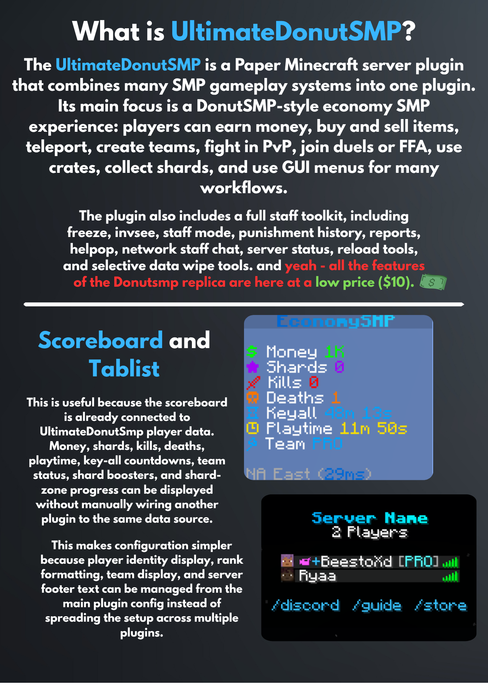
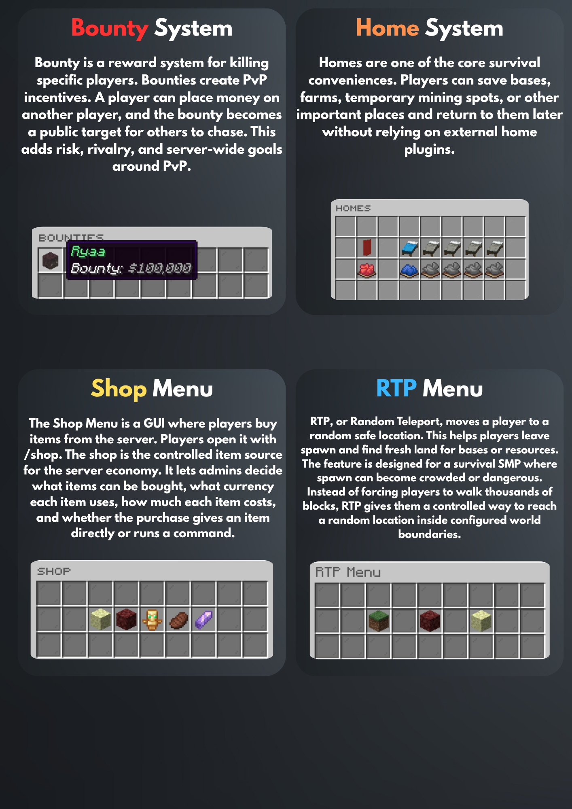
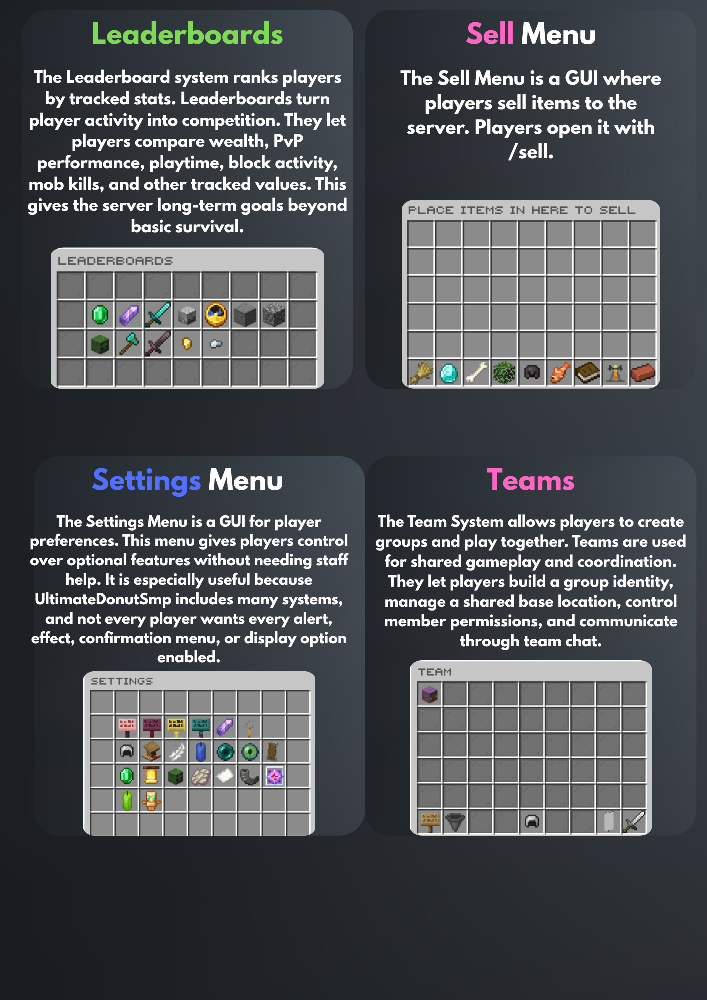

<p align="center">
  
</p>

<h1 align="center">UltimateDonutSmp</h1>

<p align="center">
  Premium Paper plugin for DonutSMP-style Minecraft servers.
  Economy, PvP, marketplace, staff tools, menus, network utilities, and licensing in one production-focused plugin.
</p>

<p align="center">
  
  
  
  
  
</p>

> [!IMPORTANT]
> This repository contains proprietary premium plugin source code. It is not open source. Access, use, modification, build, and distribution are limited to authorized maintainers, customers, and license holders only.

> [!IMPORTANT]
> This plugin requires a valid license key to be used. You can get a free 7-day demo license from our Discord server, and you can also purchase the full license.
>
> Discord: https://dsc.gg/hellstarr

## Overview

UltimateDonutSmp is a complete Paper Minecraft server plugin built for DonutSMP-style survival networks. It combines player economy, teams, homes, warps, random teleport, shop, sell, worth, crates, shards, PvP systems, staff utilities, network communication, and GUI-driven workflows into one plugin.

The goal is to reduce the number of separate plugins required for a modern SMP server while keeping configuration, player data, permissions, placeholders, and staff operations consistent across the entire server experience.

## Highlights

| Area | Included systems |
| --- | --- |
| Economy | Money, shards, payments, shop, sell menu, worth browser, sell history, Vault support |
| Player progression | Stats, playtime, leaderboards, profiles, settings, scoreboard, tablist data |
| Teleportation | Spawn, AFK, homes, TPA, RTP, warps, portals, cuboid-triggered regions |
| Teams | Team creation, invites, homes, PvP toggle, chat, management menus |
| PvP | Duels, duel queue, FFA arenas, bounty system, fast crystal support, match stats |
| Marketplace | Auction House, Orders board, Billford trades, crates, key menus |
| Staff tools | Staff mode, freeze, vanish, invsee, profile viewer, punishment history, alts, reports, helpop |
| Network | Redis staff chat, network alerts, server status menu, Discord webhook support |
| Operations | Config reloads, stats wipe tools, optimization controls, database support, license validation |

## Screenshots

<p align="center">
  
  
  
</p>

Additional media files are included in the repository for product pages, release notes, and premium listing assets.

## Requirements

| Requirement | Notes |
| --- | --- |
| Java | Java 21 |
| Server | Paper or a compatible Paper-based server matching the configured API target |
| Build tool | Maven |
| Storage | SQLite by default, with MySQL and MongoDB-backed modes available |
| Optional network layer | Redis for cross-server staff chat, reports, helpop, and server status |

Soft integrations:

- PlaceholderAPI
- LuckPerms
- Vault
- ProtocolLib
- Apollo
- NickPlus

The plugin can run without every soft dependency, but enabling them unlocks deeper permission, economy, placeholder, packet, client, and network behavior.

## Installation

1. Stop the Minecraft server.
2. Place the licensed plugin jar into the server `plugins/` directory.
3. Start the server once so the default configuration files are generated.
4. Configure `plugins/UltimateDonutSmp/license.yml` with the issued license data.
5. Configure storage in `database.yml`.
6. Review the core gameplay files such as `config.yml`, `menus.yml`, `shop.yml`, `worth.yml`, `rtp.yml`, and `messages.yml`.
7. Restart the server after first setup.

For production networks, MySQL plus Redis is recommended. For a single-server setup, SQLite is usually enough.

## Build

Authorized maintainers can build the plugin with Maven:

```bash
mvn clean package -Dultimatedonutsmp.license.publicKey="<ED25519_PUBLIC_KEY_BASE64>"
```

On Windows, the included build script can be used:

```bat
build.bat
```

Build artifacts are written to `target/`. Use the shaded jar for deployment when dependency relocation is required.

> [!WARNING]
> Only the public license verification key should be bundled or committed. Private signing keys, customer license files, database credentials, Discord tokens, and Redis passwords must never be committed.

## Configuration

| File | Purpose |
| --- | --- |
| `config.yml` | Global feature toggles, locations, teleport cooldowns, combat, shards, key-all, tablist, optimization, and gameplay behavior |
| `messages.yml` | Command, system, and moderation messages |
| `menus.yml` | GUI layouts for player, economy, staff, profile, rules, server, and admin workflows |
| `database.yml` | SQLite, MySQL, MongoDB, and Redis connection settings |
| `shop.yml` | Shop categories, items, prices, currencies, and command rewards |
| `worth.yml` | Sell prices and worth browser settings |
| `rtp.yml` | Random teleport world settings, cooldowns, radius, menu, and safety behavior |
| `network.yml` | Network staff chat, helpop, reports, and server status |
| `auction-house.yml` | Auction House behavior and limits |
| `orders.yml` | Orders marketplace settings |
| `duels.yml` | Duel arenas, queues, countdowns, rules, and menus |
| `ffa.yml` | FFA arenas, rollback behavior, match rules, and stats |
| `crates.yml` | Crates, keys, rewards, animations, holograms, and particles |
| `spawners.yml` | Donut-style spawners, anti-ESP, storage, drops, and menus |
| `staff-mode.yml` | Staff mode hotbar, vanish, better view, staff list, and moderation menus |
| `license.yml` | Runtime license configuration |

Most player-facing text, GUI layouts, prices, cooldowns, permissions, and feature toggles are configurable without recompiling the plugin.

## Commands

UltimateDonutSmp registers a large command surface. Common entry points include:

| Category | Commands |
| --- | --- |
| Player | `/spawn`, `/afk`, `/home`, `/sethome`, `/rtp`, `/warp`, `/tpa`, `/settings`, `/stats` |
| Economy | `/balance`, `/pay`, `/shop`, `/sell`, `/sellhand`, `/sellall`, `/worth`, `/shards` |
| Marketplace | `/auctionhouse`, `/ah`, `/orders`, `/billford`, `/bounty` |
| PvP | `/duel`, `/queue`, `/leave`, `/draw`, `/ffa`, `/ffastats` |
| Crates | `/crates`, `/keys`, `/crate` |
| Staff | `/staffmode`, `/freeze`, `/vanish`, `/invsee`, `/profileviewer`, `/punishments`, `/alts` |
| Moderation | `/ban`, `/tempban`, `/mute`, `/tempmute`, `/warn`, `/kick`, `/blacklist`, `/unban`, `/unmute` |
| Network support | `/staffchat`, `/helpop`, `/report`, `/servers` |
| Admin | `/ultimatedonutsmp`, `/uds`, `/arena`, `/ffaarena`, `/portalmanager`, `/cuboid`, `/amethysttool` |

See `src/main/resources/plugin.yml` for the complete command and permission registration.

## Repository Layout

```text
src/main/java/com/bx/ultimateDonutSmp/   Java source code
src/main/resources/                      plugin.yml and default configuration files
docs/                                    Feature documentation and system plans
discord-bot-example/                     Optional external Discord bot reference
tools/                                   Internal license tooling
target/                                  Maven build output
```

## Documentation

- [Full feature documentation](docs/fitur-ultimatedonutsmp.md)
- [Changelog](CHANGELOG.md)
- Individual system plans are available in the `docs/` directory.

## Premium Licensing

UltimateDonutSmp is proprietary commercial software.

- This repository does not grant an open-source license.
- Source access does not transfer ownership or redistribution rights.
- The plugin may only be used by authorized license holders.
- Redistribution, resale, sublicensing, public mirroring, or disclosure of source code is not permitted without written permission.
- Runtime license checks are part of the product and must not be removed or bypassed.

Copyright (c) 2026 UltimateDonutSmp. All rights reserved.

## Support

Support is handled through the official purchase or customer support channel. When reporting an issue, include:

- Plugin version and jar build
- Server software and version
- Java version
- Relevant configuration snippets with secrets removed
- Console errors or stack traces
- Steps to reproduce the issue

Do not share license keys, database credentials, Redis passwords, Discord tokens, or private customer files in public channels.
