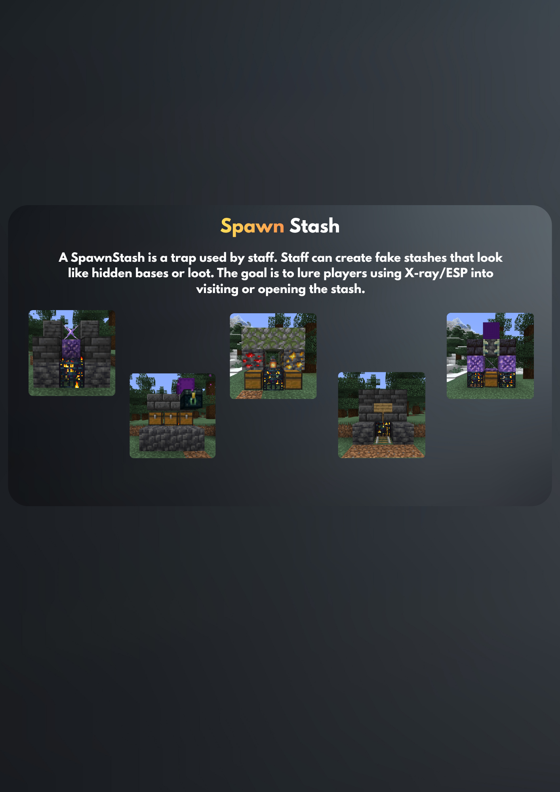

<p align="center">
  
</p>

<h1 align="center">UltimateDonutSmp</h1>

<p align="center">
  Free Paper, Spigot, and Folia plugin for DonutSMP-style Minecraft servers.
  Economy, PvP, marketplace, staff tools, menus, and network utilities in one production-focused plugin.
</p>

<p align="center">
  
  
  
  
</p>

## Overview

UltimateDonutSmp is a complete Paper Minecraft server plugin built for DonutSMP-style survival networks. It combines player economy, teams, homes, warps, random teleport, shop, sell, worth, crates, shards, PvP systems, staff utilities, network communication, and GUI-driven workflows into one plugin.

The goal is to reduce the number of separate plugins required for a modern SMP server while keeping configuration, player data, permissions, placeholders, and staff operations consistent across the entire server experience.

## Documentation

This README is the quick reference. The full documentation set lives in [`docs/wiki/`](docs/wiki):

| Page | Contents |
| --- | --- |
| [Home](docs/wiki/Home.md) | Documentation index and technical quick facts |
| [Installation & Setup](docs/wiki/Installation-and-Setup.md) | Server engine setup, SQLite/MySQL/MongoDB storage, and Redis networking |
| [Commands & Permissions](docs/wiki/Commands-and-Permissions.md) | Full command syntax, aliases, and permission nodes |
| [Configuration Reference](docs/wiki/Configuration-Reference.md) | Every configuration file, plus a `Config-*.yml.md` page per file |
| [Economy & Marketplaces](docs/wiki/Economy-and-Marketplaces.md) | Money, shards, shop, sell, Auction House, Orders, and Billford |
| [Duels & FFA](docs/wiki/Duels-and-FFA.md) | Duel arenas, queues, rollbacks, and instanced FFA |
| [Crates & Spawners](docs/wiki/Crates-and-Spawners.md) | Crate definitions, keys, and Donut-style spawners |
| [Cuboids & Portals](docs/wiki/Cuboids-and-Portals.md) | Region selection, feature zone binding, and portal triggers |
| [Staff & Security](docs/wiki/Staff-and-Security.md) | Staff mode, punishments, detection tools, and moderation |
| [Placeholders & Integrations](docs/wiki/Placeholders-and-Integrations.md) | PlaceholderAPI expansions and third-party plugin support |
| [FAQ](docs/wiki/FAQ.md) | Common questions and troubleshooting |

## Highlights

| Area | Included systems |
| --- | --- |
| Platforms | Separate Paper/Spigot and Folia builds with compatibility checks against the latest published APIs |
| Economy | Money, shards, player payments, Vault provider, shop, sell workflows, sell multipliers, worth browser, and sell history |
| Marketplaces | Auction House, Orders board, Billford rotating trades, category filters, claims, delivery, and search |
| Player systems | Teams, friends/follows, homes, warps, private messages, ignore lists, profiles, settings, and custom Ender Chests |
| Progression | Stats, playtime, leaderboards, scoreboards, tablists, bounties, and PlaceholderAPI expansions |
| Teleportation | Spawn, AFK areas, TPA, RTP, portals, cuboid triggers, teleport areas, and safe-location checks |
| PvP | Duels, private invites, map queues, FFA instances, arena rollback, fast crystals, and combat handling |
| Custom content | Crates, virtual keys, Donut-style spawners, amethyst tools, enchantment GUI, filters, and configurable menus |
| Staff and moderation | Staff mode, freeze, vanish, hide/disguise, invsee, ecsee, punishments, alts, reports, helpop, and anvil moderation |
| Detection tools | Spawn-stash bait, fake-player bait, spawner anti-ESP, alerts, bypass permissions, and crash protection |
| Network | Redis staff chat and alerts, server-status menus, maintenance routing, Discord webhooks, and Lunar/Apollo support |
| Operations | Automatic configuration sync and backups, feature toggles, setup tools, optimization controls, stats wipe, and guarded server wipe |
| Localization | English, Spanish, Indonesian, Portuguese, German, French, Russian, and Simplified Chinese language packs |

## Screenshots

Feature panels and in-game menus:

|   |   |   |
| :---: | :---: | :---: |
|  |  |  |
|  |  |  |
|  |  |  |
|  |  |  |
|  |  |  |
|  |  |  |
|  |   |   |

Gameplay clips:

|   |   |
| :---: | :---: |
|  |  |
|  |  |
|  |  |

## Requirements

| Requirement | Notes |
| --- | --- |
| Plugin version | `1.5` |
| Java | Bytecode targets Java 21. Use the Java version required by the selected Minecraft server; Minecraft 26.1+ requires Java 25. |
| Paper / Spigot | Minecraft `1.21.10` through `26.2` |
| Folia | Minecraft `1.21.11` through `26.2` |
| Hard dependencies | PlaceholderAPI and ProtocolLib (declared under `depend` in `plugin.yml`; the plugin will not load without them) |
| Default storage | SQLite, bundled through the shaded JDBC driver |
| Alternative storage | MySQL or MongoDB |
| Optional network layer | Redis for cross-server staff chat, alerts, maintenance, reports, helpop, and server status |
| Build environment | Maven available as `mvn`, internet access, and a JDK 21 or newer toolchain (CI builds on JDK 25) |

Required plugins (the server will not enable UltimateDonutSmp without them):

- PlaceholderAPI
- ProtocolLib

Optional integrations:

- LuckPerms
- Vault
- Apollo
- SkinsRestorer
- Multiverse-Core
- floodgate

The plugin starts without the optional integrations. Their related permission, economy, client, skin, world, and Bedrock features activate only when the corresponding plugin is installed.

## Building

Build the project using standard Maven or the build script:

```bat
build.bat
```

Or run Maven directly:

```bash
mvn clean package
```

The build compiles the codebase against the target API and packages a single unified JAR that automatically detects and adapts to Paper, Spigot, or Folia at runtime.

Generated artifact is saved to the `target/` directory:

- `UltimateDonutSmp-1.5.jar` (shaded JAR)

## Installation

1. Stop the Minecraft server.
2. Place the plugin jar into the server `plugins/` directory.
3. Start the server once so the default configuration files are generated.
4. Configure storage in `database.yml`.
5. Review the core gameplay files such as `config.yml`, `menus.yml`, `shop.yml`, `worth.yml`, `rtp.yml`, and `messages.yml`.
6. Restart the server after first setup.

For production networks, MySQL plus Redis is recommended. For a single-server setup, SQLite is usually enough.

> [!WARNING]
> Do not share private customer files, database credentials, Discord tokens, Redis passwords, or other sensitive server data.

## Configuration

| File | Purpose |
| --- | --- |
| `config.yml` | Language selection, feature toggles, locations, portals, chat, AFK, cuboid binds, combat, crystals, shards, tablist, optimization, and general gameplay |
| `messages.yml` | Legacy command, gameplay, moderation, economy, teleport, and system messages |
| `death-messages.yml` | Death-message rules and message templates |
| `menus.yml` | Shared GUI layouts for teams, homes, profiles, settings, leaderboards, shops, staff tools, rules, servers, and other menus |
| `scoreboard.yml` | Scoreboard title, lines, refresh behavior, and display rules |
| `shop.yml` | Money and shard shop categories, items, prices, permissions, currencies, and command rewards |
| `sounds.yml` | Sound effects for menus, commands, teleportation, shops, shards, boosters, and custom systems |
| `billford.yml` | Billford rotation, access permission, countdowns, announcements, trades, GUI, and feedback |
| `rtp.yml` | Random teleport worlds, radius, cooldowns, safety checks, denied worlds, messages, and GUI |
| `worth.yml` | Sell values, worth display, container handling, browser categories, and blocked items |
| `amethyst-tools.yml` | Amethyst tool types, durations, permissions, effects, items, actions, and messages |
| `ender-chest.yml` | Custom Ender Chest size, behavior, ecsee access, layout, and messages |
| `invsee.yml` | Inventory inspection behavior, layout, permissions, and messages |
| `freeze.yml` | Freeze behavior, permissions, alerts, inventory handling, and messages |
| `auction-house.yml` | Listing limits, pricing, claims, restrictions, sorting, categories, and Auction House GUI |
| `orders.yml` | Order limits, pricing, delivery, matching, filters, sorting, Bedrock input, network behavior, and GUI |
| `enchantments.yml` | Enchantment GUI and item-specific enchantment options |
| `filter.yml` | Item category filters used by marketplace and inventory workflows |
| `duels.yml` | Duel maps, world borders, queues, countdowns, cross-server options, arena settings, rules, and GUI |
| `ffa.yml` | FFA queue, arena rules, rollback, player-state handling, and arena definitions |
| `crates.yml` | Crate definitions, keys, rewards, animations, holograms, particles, and settings |
| `spawners.yml` | Donut-style spawner types, drops, storage, anti-ESP, visibility, and GUI |
| `spawn-stash.yml` | Temporary bait-stash types, detection rules, alerts, cleanup, and messages |
| `network.yml` | Redis network identity, staff chat, reports, helpop, server status, and maintenance routing |
| `staff-mode.yml` | Staff-mode permissions, hotbar items, vanish, better view, staff list, fake players, and menus |
| `hide.yml` | Identity scrambling, aliases, disguises, skins, cooldowns, bypass rules, GUI, and messages |
| `database.yml` | SQLite, MySQL, MongoDB, and Redis connection settings |
| `server-wipe.yml` | Guarded wipe targets, protected worlds, confirmation token lifetime, backups, and messages |
| `discord.yml` | Discord webhook endpoints and event-specific webhook controls |
| `anvil-moderation.yml` | Banned anvil words, punishments, and per-player moderation data |
| `offenses.yml` | Preset offense rules, punishment types, and durations used by `/offend` |

Language files are stored under `languages/`:

- `en_US.yml`
- `es_ES.yml`
- `id_ID.yml`
- `pt_BR.yml`
- `de_DE.yml`
- `fr_FR.yml`
- `ru_RU.yml`
- `zh_CN.yml`

On startup and reload, missing bundled configuration paths are merged into existing files. Existing files are backed up under `config-backups/` before an automatic update. Live crate definitions, duel/FFA arenas, and deployment-specific network server entries are treated as user-managed data and are not restored after removal.

## Commands

Commands can be disabled through their related feature toggle. Arguments in `<angle brackets>` are required; arguments in `[square brackets]` are optional. Every command has a dedicated permission node registered in `plugin.yml`. Most follow the `ultimatedonutsmp.command.<command>` pattern; a few staff commands use a `ultimatedonutsmp.staff.*` node instead, as listed below.

| Command | Aliases | Usage | Permission Node |
| --- | --- | --- | --- |
| `/addmoney` | - | `/addmoney <player> <amount>` | `ultimatedonutsmp.command.addmoney` |
| `/addshards` | - | `/addshards <player> <amount>` | `ultimatedonutsmp.command.addshards` |
| `/afk` | - | `/afk` | `ultimatedonutsmp.command.afk` |
| `/alts` | - | `/alts <player>` | `ultimatedonutsmp.command.alts` |
| `/amethysttool` | - | `/amethysttool give <player> <type> [duration]` or `/amethysttool reload` | `ultimatedonutsmp.command.amethysttool` |
| `/amod` | - | `/amod <add\|reload>` | `ultimatedonutsmp.command.amod` |
| `/arena` | `/duelarena` | `/arena <create\|delete\|setpos1\|setpos2\|setreturn\|setdisplay\|enable\|disable\|queue\|list\|reload>` | `ultimatedonutsmp.command.arena` |
| `/auctionhouse` | `/ah` | `/auctionhouse [sell\|my\|claims\|cancel\|limit\|fastbuy\|fastsell\|reload]` | `ultimatedonutsmp.command.auctionhouse` |
| `/balance` | `/bal`, `/money` | `/balance [player]` | `ultimatedonutsmp.command.balance` |
| `/ban` | - | `/ban <player> [reason]` | `ultimatedonutsmp.command.ban` |
| `/billford` | - | `/billford` | `ultimatedonutsmp.command.billford` |
| `/blacklist` | - | `/blacklist <player> [reason]` | `ultimatedonutsmp.command.blacklist` |
| `/bounty` | - | `/bounty <add\|set\|info\|list> [player] [amount]` | `ultimatedonutsmp.command.bounty` |
| `/chat` | - | `/chat <help\|mute\|unmute\|delay\|clear>` | `ultimatedonutsmp.command.chat` |
| `/clearlag` | - | `/clearlag` | `ultimatedonutsmp.command.clearlag` |
| `/crate` | - | `/crate <create\|delete\|type\|open\|keys\|reload\|key\|take\|set\|keyall\|add\|edit\|remove\|bind\|unbind\|info>` | `ultimatedonutsmp.command.crate` |
| `/crates` | - | `/crates` | `ultimatedonutsmp.command.crates` |
| `/create` | - | `/create <invite\|friends> <player> [map]` | `ultimatedonutsmp.command.create` |
| `/cuboid` | - | `/cuboid <wand\|create\|delete\|list\|bind <cuboid> <spawn\|shard\|rtp-zone> <true\|false>\|reload>` | `ultimatedonutsmp.command.cuboid` |
| `/delhome` | - | `/delhome <name>` | `ultimatedonutsmp.command.delhome` |
| `/delwarp` | - | `/delwarp <name>` | `ultimatedonutsmp.command.delwarp` |
| `/discord` | - | `/discord` | `ultimatedonutsmp.command.discord` |
| `/disguise` | - | `/disguise [player-name\|url]` or `/disguise <alias> <player-name\|url>` | `ultimatedonutsmp.command.disguise` |
| `/draw` | - | `/draw` | `ultimatedonutsmp.command.draw` |
| `/duel` | - | `/duel [player\|accept\|deny\|claims\|reload]` | `ultimatedonutsmp.command.duel` |
| `/ecsee` | - | `/ecsee <player>` | `ultimatedonutsmp.command.ecsee` |
| `/enderchest` | `/ec` | `/enderchest [reload]` | `ultimatedonutsmp.command.enderchest` |
| `/fakeplayer` | `/fplayer` | `/fakeplayer` | `ultimatedonutsmp.command.fakeplayer` |
| `/feed` | - | `/feed [player]` | `ultimatedonutsmp.command.feed` |
| `/ffa` | - | `/ffa [join\|reload\|arena ...]` | `ultimatedonutsmp.command.ffa` |
| `/ffaarena` | - | `/ffaarena <create\|delete\|setpos\|setdisplay\|settings\|enable\|disable\|list\|reload>` | `ultimatedonutsmp.command.ffaarena` |
| `/ffastats` | - | `/ffastats [player]` | `ultimatedonutsmp.command.ffastats` |
| `/findplayer` | `/fp` | `/findplayer <player>` | `ultimatedonutsmp.command.findplayer` |
| `/fly` | - | `/fly [player]` | `ultimatedonutsmp.command.fly` |
| `/flyspeed` | `/fs` | `/flyspeed <1-10> [player]` | `ultimatedonutsmp.command.flyspeed` |
| `/freeze` | - | `/freeze <player>` or `/freeze reload` | `ultimatedonutsmp.command.freeze` |
| `/friend` | - | `/friend` | `ultimatedonutsmp.command.friend` |
| `/friends` | - | `/friends [list\|follow\|remove\|search\|following\|followers\|friends]` | `ultimatedonutsmp.command.friends` |
| `/gamemode` | `/gm`, `/gmc`, `/gms`, `/gma`, `/gmsp` | `/gamemode <mode> [player]` | `ultimatedonutsmp.command.gamemode` |
| `/god` | `/godmode` | `/god [player]` | `ultimatedonutsmp.staff.god` |
| `/heal` | - | `/heal [player]` | `ultimatedonutsmp.command.heal` |
| `/help` | - | `/help` | `ultimatedonutsmp.command.help` |
| `/helpop` | - | `/helpop <message>` | `ultimatedonutsmp.command.helpop` |
| `/hide` | - | `/hide [status\|scramble\|remove\|check <player>\|list]` | `ultimatedonutsmp.command.hide` |
| `/home` | - | `/home [name]` | `ultimatedonutsmp.command.home` |
| `/homes` | - | `/homes` | `ultimatedonutsmp.command.homes` |
| `/ignore` | - | `/ignore <player\|list>` | `ultimatedonutsmp.command.ignore` |
| `/invsee` | `/inventorysee` | `/invsee <player>` or `/invsee reload` | `ultimatedonutsmp.command.invsee` |
| `/keys` | - | `/keys` | `ultimatedonutsmp.command.keys` |
| `/kick` | - | `/kick <player> [reason]` | `ultimatedonutsmp.command.kick` |
| `/kill` | - | `/kill` | `ultimatedonutsmp.command.kill` |
| `/leaderboard` | `/lb`, `/top`, `/leaderboards`, `/baltop` | `/leaderboard [type]` | `ultimatedonutsmp.command.leaderboard` |
| `/leave` | - | `/leave` | `ultimatedonutsmp.command.leave` |
| `/logs` | - | `/logs` | `ultimatedonutsmp.command.logs` |
| `/maintenance` | - | `/maintenance <on\|off\|status\|setlobby [server]>` | `ultimatedonutsmp.command.maintenance` |
| `/msg` | `/message`, `/tell`, `/whisper`, `/w` | `/msg <player> <message>` | `ultimatedonutsmp.command.msg` |
| `/mute` | - | `/mute <player> [reason]` | `ultimatedonutsmp.command.mute` |
| `/nightvision` | `/nv` | `/nightvision` | `ultimatedonutsmp.command.nightvision` |
| `/offend` | - | `/offend <player> <reason> [time]` | `ultimatedonutsmp.staff.punishments.offend` |
| `/orders` | - | `/orders [my\|collect\|reload\|search query]` | `ultimatedonutsmp.command.orders` |
| `/pay` | - | `/pay <player> <amount>` | `ultimatedonutsmp.command.pay` |
| `/phantom` | - | `/phantom` | `ultimatedonutsmp.command.phantom` |
| `/ping` | - | `/ping [player]` | `ultimatedonutsmp.command.ping` |
| `/playtime` | `/pt` | `/playtime [player]` | `ultimatedonutsmp.command.playtime` |
| `/pm` | `/togglepm`, `/privatemessages` | `/pm` | `ultimatedonutsmp.command.pm` |
| `/portalmanager` | - | `/portalmanager <list\|info\|create\|delete\|setcuboid\|setdestination\|setdisplay\|toggle\|setpriority\|sethologramhere>` | `ultimatedonutsmp.command.portalmanager` |
| `/profileviewer` | `/pv` | `/profileviewer <player>` | `ultimatedonutsmp.command.profileviewer` |
| `/punishments` | `/phistory` | `/punishments <player>` | `ultimatedonutsmp.command.punishments` |
| `/queue` | - | `/queue [join\|leave] [map]` | `ultimatedonutsmp.command.queue` |
| `/randomteleport` | `/randomtp` | `/randomteleport` | `ultimatedonutsmp.command.randomteleport` |
| `/removemoney` | - | `/removemoney <player> <amount>` | `ultimatedonutsmp.command.removemoney` |
| `/removeshards` | - | `/removeshards <player> <amount>` | `ultimatedonutsmp.command.removeshards` |
| `/rename` | - | `/rename <name...\|reset>` | `ultimatedonutsmp.command.rename` |
| `/renamehome` | - | `/renamehome <old> <new>` | `ultimatedonutsmp.command.renamehome` |
| `/reply` | `/r` | `/reply <message>` | `ultimatedonutsmp.command.reply` |
| `/report` | - | `/report <player> <reason>` | `ultimatedonutsmp.command.report` |
| `/rtp` | - | `/rtp [world]` | `ultimatedonutsmp.command.rtp` |
| `/rules` | - | `/rules` | `ultimatedonutsmp.command.rules` |
| `/safety` | - | `/safety [reload\|add [player]]` | `ultimatedonutsmp.command.safety` |
| `/sell` | - | `/sell` | `ultimatedonutsmp.command.sell` |
| `/sellall` | - | `/sellall` | `ultimatedonutsmp.command.sellall` |
| `/sellhand` | - | `/sellhand [amount]` | `ultimatedonutsmp.command.sellhand` |
| `/sellhistory` | - | `/sellhistory` | `ultimatedonutsmp.command.sellhistory` |
| `/sellmulti` | - | `/sellmulti [category]` | `ultimatedonutsmp.command.sellmulti` |
| `/sellmultiplier` | - | `/sellmultiplier [category]` | `ultimatedonutsmp.command.sellmulti` |
| `/sellprogress` | - | `/sellprogress [category]` | `ultimatedonutsmp.command.sellprogress` |
| `/servers` | - | `/servers` | `ultimatedonutsmp.command.servers` |
| `/serverwipe` | - | `/serverwipe <preview\|prepare\|confirm\|cancel\|status>` | `ultimatedonutsmp.command.serverwipe` |
| `/setafk` | - | `/setafk` | `ultimatedonutsmp.command.setafk` |
| `/sethome` | - | `/sethome [name]` | `ultimatedonutsmp.command.sethome` |
| `/setmoney` | - | `/setmoney <player> <amount>` | `ultimatedonutsmp.command.setmoney` |
| `/setshards` | - | `/setshards <player> <amount>` | `ultimatedonutsmp.command.setshards` |
| `/setspawn` | - | `/setspawn` | `ultimatedonutsmp.command.setspawn` |
| `/settings` | - | `/settings` | `ultimatedonutsmp.command.settings` |
| `/setwarp` | - | `/setwarp <name>` | `ultimatedonutsmp.command.setwarp` |
| `/shardpay` | - | `/shardpay <player> <amount>` | `ultimatedonutsmp.command.shardpay` |
| `/shards` | - | `/shards [player]` or `/shards everywhere <status\|debug> [player]` | `ultimatedonutsmp.command.shards` |
| `/shardshop` | - | `/shardshop` | `ultimatedonutsmp.command.shardshop` |
| `/shop` | - | `/shop [reload]` | `ultimatedonutsmp.command.shop` |
| `/social` | `/media` | `/social` | `ultimatedonutsmp.command.social` |
| `/spawn` | - | `/spawn` | `ultimatedonutsmp.command.spawn` |
| `/spawner` | `/spawners` | `/spawner [give\|info\|panel\|reload\|remove]` | `ultimatedonutsmp.command.spawner` |
| `/spawnstash` | `/stash` | `/spawnstash [type\|spawn\|list\|remove\|reload]` | `ultimatedonutsmp.command.spawnstash` |
| `/staffchat` | `/sc` | `/staffchat <message>` | `ultimatedonutsmp.command.staffchat` |
| `/stafflist` | - | `/stafflist` | `ultimatedonutsmp.command.stafflist` |
| `/staffmode` | `/staff` | `/staffmode [player\|reload]` | `ultimatedonutsmp.command.staffmode` |
| `/stats` | - | `/stats [player]` | `ultimatedonutsmp.command.stats` |
| `/store` | - | `/store` | `ultimatedonutsmp.command.store` |
| `/team` | - | `/team <create\|disband\|invite\|kick\|join\|leave\|home\|sethome\|delhome\|chat\|info\|pvp>` | `ultimatedonutsmp.command.team` |
| `/teleport` | `/tp`, `/tphere`, `/tpall` | `/teleport <player\|here <player>\|all\|top\|x y z [world]>` | `ultimatedonutsmp.command.teleport` |
| `/tempban` | - | `/tempban <player> <time> [reason]` | `ultimatedonutsmp.command.tempban` |
| `/tempmute` | - | `/tempmute <player> <time> [reason]` | `ultimatedonutsmp.command.tempmute` |
| `/topsell` | `/sellstats` | `/topsell [gui\|items\|volume\|sellers\|export]` | `ultimatedonutsmp.command.topsell` |
| `/tpa` | - | `/tpa <player>` | `ultimatedonutsmp.command.tpa` |
| `/tpacancel` | - | `/tpacancel` | `ultimatedonutsmp.command.tpacancel` |
| `/tpaccept` | - | `/tpaccept [player]` | `ultimatedonutsmp.command.tpaccept` |
| `/tpadeny` | - | `/tpadeny [player]` | `ultimatedonutsmp.command.tpadeny` |
| `/tpahere` | - | `/tpahere <player>` | `ultimatedonutsmp.command.tpahere` |
| `/tpahereauto` | - | `/tpahereauto` | `ultimatedonutsmp.command.tpahereauto` |
| `/tpauto` | - | `/tpauto` | `ultimatedonutsmp.command.tpauto` |
| `/twitter` | - | `/twitter` | `ultimatedonutsmp.command.twitter` |
| `/ultimatedonutsmp` | `/uds`, `/udsmp` | `/ultimatedonutsmp <reload\|statswipe\|optimize\|setup\|features\|maintenance>` | `ultimatedonutsmp.command.ultimatedonutsmp` |
| `/unban` | `/pardon` | `/unban <player> [reason]` | `ultimatedonutsmp.command.unban` |
| `/unblacklist` | - | `/unblacklist <player> [reason]` | `ultimatedonutsmp.command.unblacklist` |
| `/unignore` | - | `/unignore <player>` | `ultimatedonutsmp.command.unignore` |
| `/unmute` | - | `/unmute <player> [reason]` | `ultimatedonutsmp.command.unmute` |
| `/vanish` | - | `/vanish` | `ultimatedonutsmp.command.vanish` |
| `/warn` | - | `/warn <player> [reason]` | `ultimatedonutsmp.command.warn` |
| `/warp` | - | `/warp [name]` | `ultimatedonutsmp.command.warp` |
| `/warpmanager` | - | `/warpmanager <create\|delete\|list> [name]` | `ultimatedonutsmp.command.warpmanager` |
| `/worth` | `/prices` | `/worth [hand\|reload]` | `ultimatedonutsmp.command.worth` |

Temporary punishment durations accept combined values such as `30s`, `15m`, `2h`, `5d`, or `5d 15m 30s`.

Running `/baltop` with no arguments opens the money leaderboard directly instead of the leaderboard type menu.

## Permissions

`true` means the permission is granted by default to all players, `op` means it defaults to server operators, and `false` means it must be granted explicitly. `ultimatedonutsmp.admin` is the main admin parent node, and `ultimatedonutsmp.command.*` grants access to all plugin commands.

### Main Parent Nodes

| Permission Node | Default | Description |
| --- | --- | --- |
| `ultimatedonutsmp.admin` | `op` | Main admin parent node giving access to administrative commands, reload, wipe, and management systems |
| `ultimatedonutsmp.command.*` | `op` | Grants access to execute all UltimateDonutSmp commands |
| `ultimatedonutsmp.staff.mode` | `op` | Staff moderation mode parent node (vanish, betterview, randomtp, staff list, tools) |
| `ultimatedonutsmp.staff.alerts.receive` | `op` | Parent node for receiving staff alerts (`helpop` and `report`) |
| `ultimatedonutsmp.staff.punishments.create` | `op` | Parent node for issuing punishments (`warn`, `kick`, `ban`, `mute`, `blacklist`) |
| `ultimatedonutsmp.staff.punishments.remove` | `op` | Parent node for removing active punishments (`unban`, `unmute`, `unblacklist`) |

### System & Staff Permissions

| Permission | Default | Description |
| --- | --- | --- |
| `anvilmod.admin` | `op` | Admin access for anvil word moderation |
| `safety.add` | `op` | Add players to safety check bypass list |
| `safety.reload` | `op` | Reload safety configuration |
| `safety.use` | `true` | Standard safety system permission |
| `ultimatedonutsmp.admin.addmoney` | `op` | Add money to player balances |
| `ultimatedonutsmp.admin.amethysttool` | `op` | Give and reload amethyst tools |
| `ultimatedonutsmp.admin.auctionhouse` | `op` | Reload and manage Auction House settings |
| `ultimatedonutsmp.admin.clearlag` | `op` | Trigger lag clear manually |
| `ultimatedonutsmp.admin.crate` | `op` | Manage crate balances, chest bindings, and settings |
| `ultimatedonutsmp.admin.crate.keyall` | `op` | Trigger key-all rewards manually |
| `ultimatedonutsmp.admin.crate.reload` | `op` | Reload crate configuration |
| `ultimatedonutsmp.admin.cuboid` | `op` | Create, bind, and manage cuboid regions |
| `ultimatedonutsmp.admin.delwarp` | `op` | Delete public warp points |
| `ultimatedonutsmp.admin.duels` | `op` | Manage duel settings and arenas |
| `ultimatedonutsmp.admin.ecsee` | `op` | View other players' Ender Chest contents |
| `ultimatedonutsmp.admin.enderchest` | `op` | Reload Ender Chest settings |
| `ultimatedonutsmp.admin.features` | `op` | Access and toggle runtime feature switches |
| `ultimatedonutsmp.admin.ffa` | `op` | Manage FFA arenas and settings |
| `ultimatedonutsmp.admin.freeze` | `op` | Reload freeze settings |
| `ultimatedonutsmp.admin.invsee` | `op` | Reload Invsee settings |
| `ultimatedonutsmp.admin.logs` | `op` | View command log history |
| `ultimatedonutsmp.admin.maintenance` | `op` | Manage maintenance mode |
| `ultimatedonutsmp.admin.maintenance.bypass` | `op` | Join server while maintenance mode is enabled |
| `ultimatedonutsmp.admin.optimize` | `op` | Access runtime optimization controls |
| `ultimatedonutsmp.admin.orders` | `op` | Manage and reload Orders board settings |
| `ultimatedonutsmp.admin.portalmanager` | `op` | Create, display, and manage RTP portals |
| `ultimatedonutsmp.admin.reload` | `op` | Reload all UltimateDonutSmp configurations |
| `ultimatedonutsmp.admin.removemoney` | `op` | Remove money from player balances |
| `ultimatedonutsmp.admin.sellstats` | `op` | View top sell statistics and economy metrics |
| `ultimatedonutsmp.admin.serverwipe` | `op` | Execute guarded server wipe operations |
| `ultimatedonutsmp.admin.setmoney` | `op` | Set player money balances |
| `ultimatedonutsmp.admin.setup` | `op` | Use interactive setup status and tools |
| `ultimatedonutsmp.admin.setwarp` | `op` | Set public warp points |
| `ultimatedonutsmp.admin.shards` | `op` | Inspect Shards Everywhere status |
| `ultimatedonutsmp.admin.shop` | `op` | Reload shop settings |
| `ultimatedonutsmp.admin.spawner` | `op` | Give and manage Donut-style spawners |
| `ultimatedonutsmp.admin.spawner.seeall` | `op` | Bypass spawner anti-ESP concealment |
| `ultimatedonutsmp.admin.spawnstash` | `op` | Manage bait spawn stashes |
| `ultimatedonutsmp.admin.staffmode` | `op` | Reload Staff Mode settings |
| `ultimatedonutsmp.admin.statswipe` | `op` | Execute player stats wipe |
| `ultimatedonutsmp.admin.teleportareas.delete` | `op` | Delete configured teleport areas |
| `ultimatedonutsmp.admin.warpmanager` | `op` | Manage public warps |
| `ultimatedonutsmp.admin.worth` | `op` | Reload sell/worth settings |
| `ultimatedonutsmp.command.flyspeed` | `op` | Use `/flyspeed` |
| `ultimatedonutsmp.command.offend` | `op` | Use `/offend` (parent of `ultimatedonutsmp.staff.punishments.offend`) |

### Staff Moderation & Alert Permissions

| Permission | Default | Description |
| --- | --- | --- |
| `ultimatedonutsmp.staff.alerts.bypass-cooldown` | `op` | Bypass report and helpop cooldowns |
| `ultimatedonutsmp.staff.alerts.receive` | `op` | Receive helpop and report staff alerts |
| `ultimatedonutsmp.staff.alts` | `op` | Check IP history and alt accounts |
| `ultimatedonutsmp.staff.chat.bypass.delay` | `op` | Bypass global chat delay |
| `ultimatedonutsmp.staff.chat.bypass.filter` | `op` | Bypass global chat filter |
| `ultimatedonutsmp.staff.chat.bypass.mute` | `op` | Bypass global chat mute |
| `ultimatedonutsmp.staff.chat.clear` | `op` | Clear chat screen visually |
| `ultimatedonutsmp.staff.chat.delay` | `op` | Set global chat delay |
| `ultimatedonutsmp.staff.chat.mute` | `op` | Mute global chat |
| `ultimatedonutsmp.staff.chat.unmute` | `op` | Unmute global chat |
| `ultimatedonutsmp.staff.chat.use` | `op` | Send and receive staff chat |
| `ultimatedonutsmp.staff.fakeplayer` | `op` | Spawn fake player bait entities |
| `ultimatedonutsmp.staff.fakeplayer.alert` | `op` | Receive fake player bait attack alerts |
| `ultimatedonutsmp.staff.fakeplayer.bypass` | `op` | Bypass fake player bait triggers |
| `ultimatedonutsmp.staff.feed` | `op` | Feed players |
| `ultimatedonutsmp.staff.fly` | `op` | Toggle flight mode |
| `ultimatedonutsmp.staff.flyspeed` | `op` | Adjust flying speed for yourself or another player |
| `ultimatedonutsmp.staff.freeze` | `op` | Freeze/unfreeze players for inspection |
| `ultimatedonutsmp.staff.freeze.alert` | `op` | Receive player freeze alerts |
| `ultimatedonutsmp.staff.freeze.exempt` | `op` | Exempt from being frozen by staff |
| `ultimatedonutsmp.staff.gamemode` | `op` | Change own gamemode |
| `ultimatedonutsmp.staff.gamemode.others` | `op` | Change other players' gamemodes |
| `ultimatedonutsmp.staff.god` | `op` | Toggle god mode |
| `ultimatedonutsmp.staff.heal` | `op` | Heal players |
| `ultimatedonutsmp.staff.helpop.receive` | `op` | Receive helpop request alerts |
| `ultimatedonutsmp.staff.invsee` | `op` | Inspect player inventories |
| `ultimatedonutsmp.staff.invsee.modify` | `op` | Modify player inventories in invsee |
| `ultimatedonutsmp.staff.mode.betterview` | `op` | Toggle better view in staff mode |
| `ultimatedonutsmp.staff.mode.others` | `op` | Toggle staff mode for other players |
| `ultimatedonutsmp.staff.mode.randomtp` | `op` | Random teleport in staff mode |
| `ultimatedonutsmp.staff.mode.seevanished` | `op` | See vanished staff members |
| `ultimatedonutsmp.staff.mode.stafflist` | `op` | Open online staff list |
| `ultimatedonutsmp.staff.mode.vanish` | `op` | Toggle vanish in staff mode |
| `ultimatedonutsmp.staff.profileviewer` | `op` | View player profiles and homes |
| `ultimatedonutsmp.staff.punishments.ban` | `false` | Apply ban and tempban punishments |
| `ultimatedonutsmp.staff.punishments.blacklist` | `false` | Apply blacklist punishments |
| `ultimatedonutsmp.staff.punishments.delete` | `op` | Delete punishment logs from GUI |
| `ultimatedonutsmp.staff.punishments.mute` | `false` | Apply mute and tempmute punishments |
| `ultimatedonutsmp.staff.punishments.offend` | `op` | Apply preset offense punishments from `offenses.yml` |
| `ultimatedonutsmp.staff.punishments.unban` | `false` | Remove active bans |
| `ultimatedonutsmp.staff.punishments.unblacklist` | `false` | Remove active blacklists |
| `ultimatedonutsmp.staff.punishments.unmute` | `false` | Remove active mutes |
| `ultimatedonutsmp.staff.punishments.view` | `op` | View punishment history |
| `ultimatedonutsmp.staff.rename` | `op` | Rename items |
| `ultimatedonutsmp.staff.report.receive` | `op` | Receive player report alerts |
| `ultimatedonutsmp.staff.spawnstash` | `op` | Place and inspect spawn stash bait |
| `ultimatedonutsmp.staff.spawnstash.alert` | `op` | Receive spawn stash trigger alerts |
| `ultimatedonutsmp.staff.spawnstash.bypass` | `op` | Bypass spawn stash detection |
| `ultimatedonutsmp.staff.teleport` | `op` | Access staff teleport tools |

### Player & Feature Permissions

| Permission | Default | Description |
| --- | --- | --- |
| `donutauction.use` / `ultimatedonutsmp.auctionhouse.use` | `true` / `false` | Open Auction House GUI |
| `donutauction.buy` / `ultimatedonutsmp.auctionhouse.buy` | `true` / `false` | Buy items on Auction House |
| `donutauction.sell` / `ultimatedonutsmp.auctionhouse.sell` | `true` / `false` | Sell items on Auction House |
| `donutauction.my` / `ultimatedonutsmp.auctionhouse.my` | `true` / `false` | View own listings on Auction House |
| `donutauction.claims` / `ultimatedonutsmp.auctionhouse.claims` | `true` / `false` | Collect claims from Auction House |
| `donutauction.cancel` / `ultimatedonutsmp.auctionhouse.cancel` | `true` / `false` | Cancel own listings on Auction House |
| `donutauction.limit` / `ultimatedonutsmp.auctionhouse.limit` | `true` / `false` | Check listing limits on Auction House |
| `donutauction.fastbuy` / `ultimatedonutsmp.auctionhouse.fastbuy` | `false` / `op` | Fast buy command access |
| `donutauction.fastsell` / `ultimatedonutsmp.auctionhouse.fastsell` | `false` / `op` | Fast sell command access |
| `ultimatedonutsmp.command.friend` | `true` | Use `/friend` |
| `ultimatedonutsmp.command.sellmulti` | `true` | Open the sell multiplier menu (`/sellmulti`, `/sellmultiplier`) |
| `ultimatedonutsmp.command.sellprogress` | `true` | Open the sell multiplier progress menu (`/sellprogress`) |
| `ultimatedonutsmp.enderchest` | `true` | Open custom Ender Chest |
| `ultimatedonutsmp.friends` | `true` | Friends and follow system |
| `ultimatedonutsmp.helpop` | `true` | Use `/helpop` to request staff help |
| `ultimatedonutsmp.hide.admin` | `op` | Manage and inspect player disguises |
| `ultimatedonutsmp.hide.bypass` | `op` | Bypass disguise restrictions |
| `ultimatedonutsmp.hide.disguise` | `op` | Change skin and disguise alias |
| `ultimatedonutsmp.hide.scramble` | `op` | Scramble public username |
| `ultimatedonutsmp.ignore` | `true` | Ignore and unignore players |
| `ultimatedonutsmp.ignore.bypass` | `op` | Bypass private message ignore filter |
| `ultimatedonutsmp.message` | `true` | Send and reply to private messages |
| `ultimatedonutsmp.message.bypass-disabled` | `op` | Bypass recipient disabled PMs |
| `ultimatedonutsmp.message.toggle` | `true` | Toggle private messages on/off |
| `ultimatedonutsmp.report` | `true` | Report players to online staff |
| `ultimatedonutsmp.servers` | `false` | View network server status GUI |
| `ultimatedonutsmp.shards.everywhere` | `false` | Receive passive Shards Everywhere rewards |
| `ultimatedonutsmp.shardshop` | `true` | Open Shard Shop GUI |
| `ultimatedonutsmp.spawner.bypass` | `false` | Break spawners without a Silk Touch pickaxe while `REQUIRE_SILK_TOUCH` is enabled |
| `rank.media` | `false` | Display configurable Media tablist badge (requires explicit LuckPerms assignment, not auto-granted to OP) |
| `rank.media.plus` | `false` | Display configurable Media+ tablist badge (requires explicit LuckPerms assignment, not auto-granted to OP) |
| `rank.media.include` | `false` | Include player in media badge handling (requires explicit LuckPerms assignment, not auto-granted to OP) |

## Placeholders

UltimateDonutSmp includes built-in [PlaceholderAPI](https://placeholderapi.com/) expansion modules for player economy, statistics, locations, countdowns, leaderboards, player ranks, and disguise states.

Placeholder expansion identifiers supported: `%economy_*%`, `%uds_*%`, `%ultimatedonutsmp_*%`, `%economylb_*%`, `%economyrank_*%`, and `%hide_*%`.

### Economy & Player Placeholders (`%economy_*%` / `%uds_*%` / `%ultimatedonutsmp_*%`)

| Placeholder | Description | Example Output |
| --- | --- | --- |
| `%economy_money%` | Raw money balance | `12500.50` |
| `%economy_money_formatted%` | Formatted money with currency symbol | `$12,500.50` |
| `%economy_money_short%` / `%economy_nicestMoney%` | Compact formatted money amount | `12.5k` |
| `%economy_money_short_formatted%` | Formatted compact money with symbol | `$12.5k` |
| `%economy_shards%` | Raw shards balance | `500` |
| `%economy_shards_formatted%` | Formatted shards balance | `500 Shards` |
| `%economy_shards_short%` / `%economy_nicestShards%` | Compact formatted shards amount | `1.2k` |
| `%economy_shards_short_formatted%` | Formatted compact shards with symbol | `1.2k Shards` |
| `%economy_kills%` | Total player kill count | `42` |
| `%economy_deaths%` | Total player death count | `10` |
| `%economy_killstreak%` | Current active killstreak | `5` |
| `%economy_highestkillstreak%` | Highest recorded killstreak | `12` |
| `%economy_playtime%` | Total formatted playtime duration | `3d 14h 22m` |
| `%economy_blocksplaced%` | Total blocks placed count | `15400` |
| `%economy_blocksbroken%` | Total blocks broken count | `48200` |
| `%economy_mobskilled%` | Total mob kills count | `1280` |
| `%economy_moneyspent%` | Total money spent in shop/marketplaces | `50000.00` |
| `%economy_moneymade%` | Total money earned from selling/markets | `120000.00` |
| `%economy_team%` | Player's team name | `TITANS` or `none` |
| `%economy_username%` | Public display username (respects `/hide` disguise) | `Steve` |
| `%economy_ping%` | Player ping latency in ms | `24` |
| `%economy_x%` / `%economy_coord_x%` | Player X coordinate (respects coordinate obfuscation) | `120` |
| `%economy_y%` / `%economy_coord_y%` | Player Y coordinate (respects coordinate obfuscation) | `64` |
| `%economy_z%` / `%economy_coord_z%` | Player Z coordinate (respects coordinate obfuscation) | `-350` |
| `%economy_coords%` / `%economy_location%` | Formatted X, Y, Z coordinates string | `120, 64, -350` |
| `%economy_randomized_coords%` | Returns `true`/`false` if coordinate obfuscation is active | `false` |
| `%economy_donutplus%` | Displays Donut+ badge if player has permission | `&d&lDonut+ &r` |
| `%economy_keyall_countdown%` | Formatted countdown until automatic key-all reward | `05:32` |
| `%economy_booster_countdown%` | Formatted countdown for active shard booster | `14:20` or `inactive` |
| `%economy_rtp_countdown%` | Formatted countdown for RTP zone cooldown | `00:45` or `disabled` |
| `%economy_billford_countdown%` | Formatted countdown for Billford rotation | `02:15:00` or `disabled` |
| `%economy_shard_cuboid_display%` | Shard cuboid display status indicator | `[Inside Zone]` |
| `%economy_shard_cuboid_status%` | Shard cuboid status | `inside` or `outside` |
| `%economy_shard_cuboid_name%` | Name of active shard cuboid region | `MainShardArea` or `none` |
| `%economy_money_symbol%` | Currency symbol for money | `$` |
| `%economy_money_symbol_colored%` | Colored currency symbol for money | `&$` |
| `%economy_shards_symbol%` | Currency symbol for shards | `⬟` |
| `%economy_shards_symbol_colored%` | Colored currency symbol for shards | `&d⬟` |

### Leaderboard Placeholders (`%economylb_*%` / `%economy_top_*%`)

Syntax: `%economylb_<type>_<position>_<property>%` or `%economy_top_<type>_<position>_<property>%`

- **Leaderboard Types (`<type>`)**: `money`, `shards`, `kills`, `deaths`, `killstreak`, `highestkillstreak`, `playtime`, `blocksplaced`, `blocksbroken`, `mobskilled`, `moneyspent`, `moneymade`
- **Positions (`<position>`)**: Rank index starting from `1` (e.g. `1`, `2`, `3`, `10`)
- **Properties (`<property>`)**:
  - `name`: Username of the player at position
  - `value`: Full un-truncated value of the player at position
  - `value_short` / `short`: Compact formatted value (e.g. `15.4M`)
  - `rank`: Rank number index
  - `display`: Pre-formatted entry line e.g. `#1 Notch: $15.4M`

Examples:

```
%economylb_money_1_name%       -> Notch
%economylb_money_1_value%      -> $15,400,000.00
%economylb_money_1_value_short% -> 15.4M
%economylb_kills_3_display%     -> #3 Alex: 450
%economy_top_shards_1_name%    -> EnderKing
```

### Rank Leaderboard Placeholders (`%economyrank_*%`)

Syntax: `%economyrank_<type>%`

Returns the player's personal rank position number on the specified leaderboard type (e.g. `1`, `15`, or `0` if unranked).

Examples:
- `%economyrank_money%` -> `5`
- `%economyrank_kills%` -> `1`

### Hide & Disguise Placeholders (`%hide_*%`)

Syntax: `%hide_<property>%`

| Placeholder | Description | Example Output |
| --- | --- | --- |
| `%hide_active%` | Returns `true` or `false` if player has an active disguise or alias | `true` |
| `%hide_name%` / `%hide_public_name%` | Player's formatted public display name | `ShadowNinja` |
| `%hide_plain_name%` | Player's plain unformatted public display name | `ShadowNinja` |
| `%hide_mode%` | Active disguise mode (`NONE`, `SCRAMBLE`, `ALIAS`, `DISGUISE`) | `ALIAS` |
| `%hide_alias%` | Active custom alias string | `ShadowNinja` |
| `%hide_skin%` | Active custom skin username | `CustomSkin123` |

## License and Terms

UltimateDonutSmp is free, proprietary software.

- The plugin is free to use but remains under a proprietary license.
- Redistribution, resale, sublicensing, public mirroring, or unauthorized sharing is not permitted without written permission.
- You may modify the source for use on your own server; modified builds may not be distributed.
- The shaded jar bundles third-party libraries under their own licenses (Apache 2.0, MIT, and GPLv2 with the Universal FOSS Exception).
- For full licensing terms, see [LICENSE.md](LICENSE.md).
- For contribution guidelines and rules, see [CONTRIBUTING.md](CONTRIBUTING.md).

Copyright (c) 2026 UltimateDonutSmp. All rights reserved.

## Support

| Channel | Use it for |
| --- | --- |
| [GitHub Issues](https://github.com/BeestoXd/UltimateDonutSMP/issues) | Bug reports, feature requests, and documentation problems |
| [Discord](https://dsc.gg/hellstarr) | Setup help, configuration questions, and general discussion |
| [`docs/wiki/`](docs/wiki) | Guides, configuration reference, and the FAQ |

When reporting an issue, include:

- Plugin version and jar file name
- Server software and version (Paper, Spigot, or Folia)
- Java version
- Relevant configuration snippets with secrets removed
- Console errors or stack traces
- Steps to reproduce the issue

Do not share database credentials, Redis passwords, Discord webhook URLs, or other sensitive server data in public channels.
